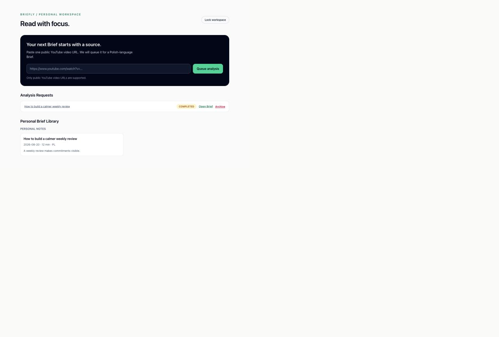
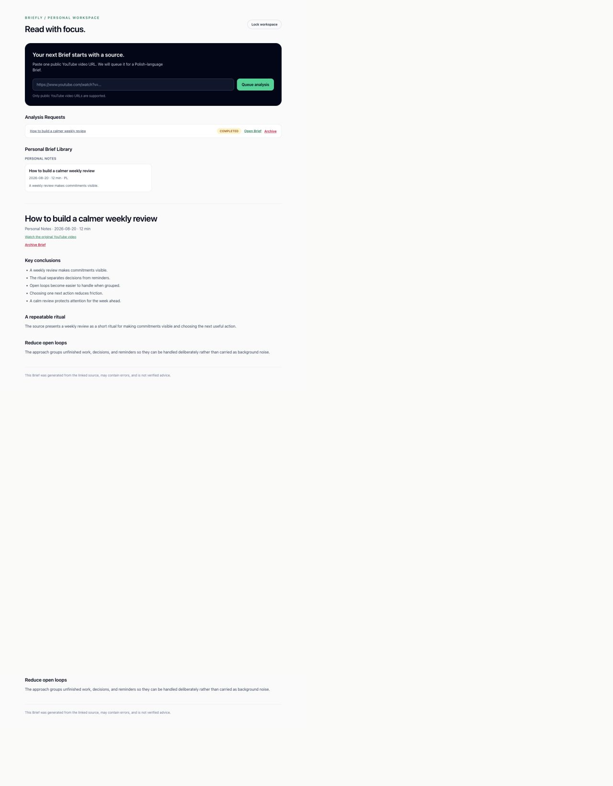

# Briefly

Briefly is a private, single-owner workspace for turning public YouTube videos into detailed, source-faithful Briefs. It is a downloadable portfolio project intended to run locally, not a deployed public service.

The application demonstrates a focused Rails workflow: submit a source, persist the request, process it asynchronously with Gemini, and read the resulting immutable Brief in a small personal library.

## Product flow

1. Unlock the password-gated Personal Workspace.
2. Paste a public YouTube video URL.
3. Queue an Analysis Request for background processing.
4. Let Gemini generate an English Brief from the source.
5. Read the saved Brief, review its key conclusions, and archive it when it is no longer active.

Briefly is source-faithful by design. Generated content is constrained to the supplied source and may contain errors; it is not independent fact-checking or verified advice.

## Screenshots

The screenshots show the main product states without requiring a hosted demo or a shared API key.






The captures are representative portfolio evidence. They may show an earlier sample output language even though the current local configuration generates English Briefs.

## Technology

- Ruby on Rails 8.1
- SQLite for application data and the Solid Queue database-backed job queue
- Solid Queue for durable background Brief generation
- Tailwind CSS 4
- Gemini API through a small HTTP adapter seam
- Rails integration, model, job, service, and configuration tests

The application is deliberately a single Rails process model with a separate local jobs process. It does not require PostgreSQL, Redis, a separate frontend deployment, a public account system, or a hosted worker service.

## Local setup

Prerequisites:

- Ruby matching `.ruby-version`
- Bundler
- Node.js and Yarn

Create local environment variables and install dependencies:

```sh
cp .env.example .env
bundle install
yarn install
bin/rails db:prepare
yarn build:css
```

Set a private local password in `.env`:

```dotenv
OWNER_PASSWORD=choose-a-long-local-development-password
```

Start the web process, CSS watcher, and jobs process together:

```sh
bin/dev
```

Then open <http://localhost:3000>, unlock the Personal Workspace, and submit a public YouTube URL.

To run the processes separately:

```sh
bin/rails server
yarn build:css:watch
bin/jobs start
```

Docker Compose is also retained as an optional local development path:

```sh
docker compose up --build
```

## Gemini API key configuration

`GEMINI_API_KEY` is read only by the Rails server and must never be committed or exposed to browser code. Add your own key to `.env` when you want to generate a new Brief:

```dotenv
GEMINI_API_KEY=your-server-side-gemini-api-key
GEMINI_MODEL=gemini-3.6-flash
```

The key is optional when opening existing local Briefs, but it is required before submitting a new Analysis Request. Each person running this downloadable project must supply and manage their own Gemini credentials and quota.

The application sends the public YouTube URL to Gemini for processing. Review Google's current Gemini terms, quotas, and data-handling policies before using personal or sensitive source material.

## Tests and checks

Run the Rails test suite with:

```sh
bin/rails test
```

Useful repository checks include:

```sh
bin/rubocop
bin/brakeman
bin/bundler-audit
```

The Gemini adapter is tested at its HTTP boundary with controlled responses. Integration tests exercise the user-visible Rails flow without requiring a network request or a real API key.

## Limitations and publication scope

This project is intentionally not a public hosted service.

- The Personal Workspace is single-owner and password-gated.
- There is no registration, multi-user account system, public library, or live public generation form.
- Gemini usage is subject to the configured account's quota, latency, availability, and model behavior.
- A generated Brief may be incomplete or inaccurate because it is an AI-generated interpretation of a source.
- Local SQLite storage and the local jobs process are chosen for portability and inspectability, not horizontal scale.
- A live public deployment was evaluated and abandoned after the free-tier host introduced long delays around application wake/build behavior. A shared public Gemini key would also make reliable access unsafe under quota limits.

Screenshots communicate the completed product flow without requiring visitors to wait for a sleeping free-tier service or consume someone else's Gemini quota. The repository is therefore best understood as a polished, runnable portfolio codebase that reviewers can download and inspect locally.
